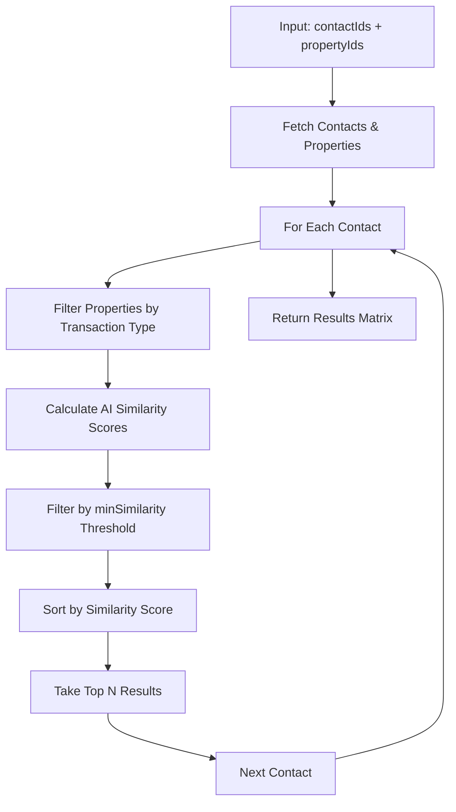

# 🚀 Batch Recommendation Processing - Developer Guide

## Overview

The **Batch Recommendation Processing** endpoint (`POST /api/recommendations/batch-process`) is a powerful feature that processes recommendations for **multiple contacts against multiple properties simultaneously**, creating a comprehensive matching matrix for bulk operations.

## 🎯 What Is Batch Processing?

### **Concept**
Batch processing takes arrays of contact IDs and property IDs, then finds the best property matches for each contact using AI-powered similarity scoring. It's designed for scenarios where you need to process many contacts against many properties efficiently.

### **Key Characteristics**
- **Many-to-Many Processing**: Multiple contacts × Multiple properties
- **Contact-Centric Results**: Each contact gets their best property matches
- **AI-Powered Matching**: Uses 12D vector similarity scoring
- **Transaction Type Filtering**: Only matches compatible transaction types
- **Performance Optimized**: Handles up to 2,500 combinations (50×50)

## 📊 Algorithm Flow



## 🌐 API Specification

### **Endpoint**
```
POST /api/recommendations/batch-process
```

### **Request Headers**
```http
Content-Type: application/json
```

### **Request Body Schema**
```typescript
interface BatchProcessRequest {
  contactIds: string[];           // Array of contact IDs (1-50)
  propertyIds: string[];          // Array of property IDs (1-50)
  minSimilarity?: number;         // Minimum similarity threshold (0-1, default: 0.3)
  limit?: number;                 // Max recommendations per contact (1-50, default: 10)
}
```

### **Response Schema**
```typescript
interface BatchProcessResponse {
  success: boolean;
  data: ContactRecommendation[];
  metadata: BatchMetadata;
  error?: string;
}

interface ContactRecommendation {
  contactId: string;
  contactName: string;
  recommendations: PropertyRecommendation[];
}

interface PropertyRecommendation {
  property: {
    id: string;
    title: string;
    price: number;
    wilaya: string;
    propertyType: string;
  };
  similarity: number;             // 0-1 similarity score
}

interface BatchMetadata {
  contactsProcessed: number;
  propertiesProcessed: number;
  totalRecommendations: number;
  minSimilarity: number;
  generatedAt: string;
}
```

## 💻 Code Examples

### **Basic Batch Processing**
```javascript
const response = await fetch('/api/recommendations/batch-process', {
  method: 'POST',
  headers: { 'Content-Type': 'application/json' },
  body: JSON.stringify({
    contactIds: [
      'contact_001',
      'contact_002',
      'contact_003'
    ],
    propertyIds: [
      'property_001',
      'property_002',
      'property_003',
      'property_004'
    ],
    minSimilarity: 0.3,
    limit: 5
  })
});

const result = await response.json();
```

### **Advanced Campaign Processing**
```javascript
// High-quality leads for premium properties
const premiumCampaign = await fetch('/api/recommendations/batch-process', {
  method: 'POST',
  headers: { 'Content-Type': 'application/json' },
  body: JSON.stringify({
    contactIds: [
      'premium_buyer_001',
      'premium_buyer_002',
      'investor_001'
    ],
    propertyIds: [
      'luxury_villa_001',
      'penthouse_002',
      'commercial_office_001'
    ],
    minSimilarity: 0.7,  // High-quality matches only
    limit: 3
  })
});
```

### **Market Analysis**
```javascript
// Broad market analysis for research
const marketAnalysis = await fetch('/api/recommendations/batch-process', {
  method: 'POST',
  headers: { 'Content-Type': 'application/json' },
  body: JSON.stringify({
    contactIds: segmentContacts,      // Large array of contacts
    propertyIds: marketProperties,    // Properties in target area
    minSimilarity: 0.2,              // Broader matching
    limit: 10
  })
});
```

## 📋 Request Examples

### **Example 1: Lead Generation Campaign**
```json
{
  "contactIds": [
    "cmd92djy5000a14ollrdik8y8",
    "cmd92djwf000914oljj04qcej",
    "cmd92djup000814olct1u4oix"
  ],
  "propertyIds": [
    "cmd92dkfg000g14olx9jckmji",
    "cmd92dk6q000d14ol3ervqga7",
    "cmd92djzw000b14ol9gzlk35h"
  ],
  "minSimilarity": 0.4,
  "limit": 5
}
```

### **Example 2: Portfolio Optimization**
```json
{
  "contactIds": [
    "investor_premium_001",
    "investor_commercial_002"
  ],
  "propertyIds": [
    "office_algiers_001",
    "retail_oran_001",
    "warehouse_constantine_001",
    "apartment_complex_001"
  ],
  "minSimilarity": 0.6,
  "limit": 3
}
```

### **Example 3: Mass Market Analysis**
```json
{
  "contactIds": [
    "segment_young_professionals",
    "segment_families",
    "segment_retirees"
  ],
  "propertyIds": [
    "new_development_001",
    "new_development_002",
    "new_development_003"
  ],
  "minSimilarity": 0.3,
  "limit": 10
}
```

## 📊 Response Examples

### **Successful Response**
```json
{
  "success": true,
  "data": [
    {
      "contactId": "cmd92djy5000a14ollrdik8y8",
      "contactName": "Sara Benmoussa",
      "recommendations": [
        {
          "property": {
            "id": "cmd92dk6q000d14ol3ervqga7",
            "title": "Bureau 120m² Centre d'Alger",
            "price": 45000000,
            "wilaya": "Algiers",
            "propertyType": "OFFICE"
          },
          "similarity": 0.875
        },
        {
          "property": {
            "id": "cmd92dkfg000g14olx9jckmji",
            "title": "Terrain constructible à Tipaza",
            "price": 8000000,
            "wilaya": "Tipaza",
            "propertyType": "LAND"
          },
          "similarity": 0.764
        }
      ]
    },
    {
      "contactId": "cmd92djwf000914oljj04qcej",
      "contactName": "Youcef Hamidi",
      "recommendations": []
    }
  ],
  "metadata": {
    "contactsProcessed": 2,
    "propertiesProcessed": 2,
    "totalRecommendations": 2,
    "minSimilarity": 0.3,
    "generatedAt": "2025-07-18T17:37:34.820Z"
  }
}
```

### **Error Response**
```json
{
  "success": false,
  "error": "Contact IDs array is required and cannot be empty"
}
```

## 🎯 Use Cases

### **1. Lead Generation Campaigns**
**Scenario**: Marketing team wants to send targeted property recommendations to a segment of contacts.

```javascript
const leadGeneration = {
  contactIds: segmentedBuyers,     // 20 qualified buyers
  propertyIds: newListings,        // 10 new properties
  minSimilarity: 0.4,              // Good quality matches
  limit: 3                         // Top 3 per contact
};
```

**Benefits**:
- Personalized property recommendations
- Higher conversion rates
- Reduced manual work

### **2. Portfolio Analysis**
**Scenario**: Real estate agency wants to analyze which properties match their investor clients.

```javascript
const portfolioAnalysis = {
  contactIds: investorClients,     // 5 investor clients
  propertyIds: commercialProperties, // 25 commercial properties
  minSimilarity: 0.6,              // High-quality matches only
  limit: 5                         // Top 5 per investor
};
```

**Benefits**:
- Strategic investment recommendations
- Market positioning insights
- Client relationship enhancement

### **3. Market Research**
**Scenario**: Research team analyzing market demand patterns.

```javascript
const marketResearch = {
  contactIds: representativeSample, // 30 contacts across segments
  propertyIds: marketProperties,    // 40 properties in area
  minSimilarity: 0.2,              // Broad analysis
  limit: 10                        // Comprehensive data
};
```

**Benefits**:
- Market demand insights
- Pricing strategy data
- Development planning information

### **4. Sales Team Optimization**
**Scenario**: Sales team needs daily property matches for their contacts.

```javascript
const dailyMatches = {
  contactIds: activeContacts,      // 15 active contacts
  propertyIds: availableProperties, // 20 available properties
  minSimilarity: 0.35,             // Balanced threshold
  limit: 4                         // Manageable follow-up list
};
```

**Benefits**:
- Streamlined sales process
- Prioritized follow-ups
- Improved productivity

## ⚙️ Performance Considerations

### **Batch Size Guidelines**

| Batch Size | Contacts | Properties | Combinations | Response Time | Use Case |
|------------|----------|------------|--------------|---------------|----------|
| **Small** | 5-10 | 5-15 | 25-150 | < 500ms | Quick campaigns |
| **Medium** | 15-25 | 20-30 | 300-750 | 500ms-2s | Regular operations |
| **Large** | 30-50 | 35-50 | 1,050-2,500 | 2s-5s | Comprehensive analysis |

### **Optimization Tips**

#### **1. Efficient Batch Sizing**
```javascript
// Good: Balanced batch
const efficientBatch = {
  contactIds: contacts.slice(0, 20),   // 20 contacts
  propertyIds: properties.slice(0, 25), // 25 properties
  minSimilarity: 0.3,
  limit: 5
};

// Avoid: Oversized batch
const oversizedBatch = {
  contactIds: allContacts,             // 100 contacts
  propertyIds: allProperties,          // 200 properties
  // This creates 20,000 combinations!
};
```

#### **2. Appropriate Similarity Thresholds**
```javascript
// Campaign targeting
const campaignConfig = {
  minSimilarity: 0.4,  // Good quality matches
  limit: 3             // Focused recommendations
};

// Market research
const researchConfig = {
  minSimilarity: 0.2,  // Broader analysis
  limit: 10            // Comprehensive data
};

// Premium clients
const premiumConfig = {
  minSimilarity: 0.7,  // High-quality only
  limit: 2             // Exclusive recommendations
};
```

#### **3. Parallel Processing**
```javascript
// Process large datasets in parallel chunks
const processInChunks = async (contacts, properties) => {
  const contactChunks = chunkArray(contacts, 20);
  const propertyChunks = chunkArray(properties, 30);
  
  const promises = contactChunks.map(contactChunk => 
    fetch('/api/recommendations/batch-process', {
      method: 'POST',
      headers: { 'Content-Type': 'application/json' },
      body: JSON.stringify({
        contactIds: contactChunk,
        propertyIds: properties, // Use all properties
        minSimilarity: 0.3,
        limit: 5
      })
    })
  );
  
  return Promise.all(promises);
};
```

## 🔧 Integration Patterns

### **1. CRM Integration**
```javascript
class CRMBatchProcessor {
  constructor(apiBase) {
    this.apiBase = apiBase;
  }

  async generateLeadsForCampaign(campaignId, minSimilarity = 0.4) {
    const campaign = await this.getCampaign(campaignId);
    
    const response = await fetch(`${this.apiBase}/recommendations/batch-process`, {
      method: 'POST',
      headers: { 'Content-Type': 'application/json' },
      body: JSON.stringify({
        contactIds: campaign.targetContacts,
        propertyIds: campaign.properties,
        minSimilarity,
        limit: 3
      })
    });

    const results = await response.json();
    return this.formatForCRM(results);
  }

  formatForCRM(batchResults) {
    return batchResults.data.map(contact => ({
      contactId: contact.contactId,
      recommendedProperties: contact.recommendations.map(rec => ({
        propertyId: rec.property.id,
        score: rec.similarity,
        priority: this.calculatePriority(rec.similarity)
      }))
    }));
  }
}
```

### **2. Email Marketing Integration**
```javascript
class EmailMarketingBatch {
  async createPersonalizedCampaign(segmentId) {
    const segment = await this.getSegment(segmentId);
    
    // Get recommendations for all contacts in segment
    const batchResults = await fetch('/api/recommendations/batch-process', {
      method: 'POST',
      headers: { 'Content-Type': 'application/json' },
      body: JSON.stringify({
        contactIds: segment.contacts,
        propertyIds: segment.targetProperties,
        minSimilarity: 0.35,
        limit: 4
      })
    });

    const recommendations = await batchResults.json();
    
    // Create personalized emails
    return recommendations.data.map(contact => ({
      contactId: contact.contactId,
      emailContent: this.generateEmailContent(contact.recommendations),
      subject: `${contact.recommendations.length} Properties Match Your Preferences`
    }));
  }
}
```

### **3. Analytics Dashboard**
```javascript
class AnalyticsDashboard {
  async getMarketInsights(region, timeframe) {
    const contacts = await this.getContactsByRegion(region);
    const properties = await this.getPropertiesByTimeframe(timeframe);
    
    const analysis = await fetch('/api/recommendations/batch-process', {
      method: 'POST',
      headers: { 'Content-Type': 'application/json' },
      body: JSON.stringify({
        contactIds: contacts.map(c => c.id),
        propertyIds: properties.map(p => p.id),
        minSimilarity: 0.2, // Broad analysis
        limit: 20
      })
    });

    const results = await analysis.json();
    
    return {
      demandAnalysis: this.analyzeDemand(results),
      priceInsights: this.analyzePricing(results),
      marketTrends: this.analyzeTrends(results)
    };
  }
}
```

## 🛡️ Error Handling

### **Common Errors**

#### **1. Validation Errors**
```json
{
  "success": false,
  "error": "Contact IDs array is required and cannot be empty"
}
```

#### **2. Size Limit Errors**
```json
{
  "success": false,
  "error": "Maximum 50 contacts and 50 properties can be processed at once"
}
```

#### **3. Server Errors**
```json
{
  "success": false,
  "error": "Failed to process batch recommendations"
}
```

### **Error Handling Implementation**
```javascript
const processBatch = async (contactIds, propertyIds) => {
  try {
    // Validate input
    if (!contactIds?.length) {
      throw new Error('Contact IDs required');
    }
    if (!propertyIds?.length) {
      throw new Error('Property IDs required');
    }
    if (contactIds.length > 50) {
      throw new Error('Too many contacts (max 50)');
    }
    if (propertyIds.length > 50) {
      throw new Error('Too many properties (max 50)');
    }

    const response = await fetch('/api/recommendations/batch-process', {
      method: 'POST',
      headers: { 'Content-Type': 'application/json' },
      body: JSON.stringify({
        contactIds,
        propertyIds,
        minSimilarity: 0.3,
        limit: 5
      })
    });

    if (!response.ok) {
      throw new Error(`HTTP ${response.status}: ${response.statusText}`);
    }

    const result = await response.json();
    
    if (!result.success) {
      throw new Error(result.error || 'Batch processing failed');
    }

    return result;
    
  } catch (error) {
    console.error('Batch processing error:', error);
    
    // Implement retry logic for transient errors
    if (error.message.includes('timeout') || error.message.includes('500')) {
      return retryBatch(contactIds, propertyIds, 3);
    }
    
    throw error;
  }
};
```

## 📈 Monitoring and Analytics

### **Performance Metrics**
```javascript
const trackBatchPerformance = (result, startTime) => {
  const metrics = {
    responseTime: Date.now() - startTime,
    contactsProcessed: result.metadata.contactsProcessed,
    propertiesProcessed: result.metadata.propertiesProcessed,
    totalRecommendations: result.metadata.totalRecommendations,
    averageRecommendationsPerContact: result.metadata.totalRecommendations / result.metadata.contactsProcessed,
    processingEfficiency: result.metadata.totalRecommendations / (result.metadata.contactsProcessed * result.metadata.propertiesProcessed)
  };
  
  // Send to analytics
  analytics.track('batch_processing_completed', metrics);
  
  return metrics;
};
```

### **Business Intelligence**
```javascript
const generateBatchInsights = (results) => {
  return {
    demandPatterns: analyzeDemandPatterns(results),
    pricePreferences: analyzePricePreferences(results),
    locationPreferences: analyzeLocationPreferences(results),
    propertyTypePreferences: analyzePropertyTypePreferences(results),
    similarityDistribution: analyzeSimilarityDistribution(results)
  };
};
```

## 🔗 Related Endpoints

### **Comparison with Other Recommendation Endpoints**

| Endpoint | Input | Output | Use Case |
|----------|-------|--------|----------|
| `/recommendations/contact/{id}` | 1 contact | Properties for contact | Individual recommendations |
| `/recommendations/property/{id}` | 1 property | Contacts for property | Property marketing |
| `/recommendations/bulk` | N properties | Contacts for each property | Bulk property marketing |
| `/recommendations/batch-process` | N contacts + M properties | Properties for each contact | Comprehensive matching |

### **Workflow Integration**
```javascript
// Complete recommendation workflow
const comprehensiveRecommendations = async (contactIds, propertyIds) => {
  // 1. Batch processing for overview
  const batchResults = await processBatch(contactIds, propertyIds);
  
  // 2. Individual detailed recommendations for top matches
  const detailedRecommendations = await Promise.all(
    batchResults.data
      .filter(contact => contact.recommendations.length > 0)
      .map(contact => getDetailedRecommendations(contact.contactId))
  );
  
  // 3. Property-specific analysis for high-interest properties
  const popularProperties = findPopularProperties(batchResults);
  const propertyAnalysis = await Promise.all(
    popularProperties.map(propId => getPropertyRecommendations(propId))
  );
  
  return {
    batchOverview: batchResults,
    detailedMatches: detailedRecommendations,
    propertyInsights: propertyAnalysis
  };
};
```

## 🎉 Summary

The **Batch Recommendation Processing** endpoint is a powerful tool for:

### **Key Benefits**
- ✅ **Efficient Processing**: Handle multiple contacts and properties simultaneously
- ✅ **AI-Powered Matching**: Advanced 12D vector similarity scoring
- ✅ **Flexible Configuration**: Adjustable similarity thresholds and limits
- ✅ **Scalable Architecture**: Optimized for performance at scale
- ✅ **Rich Metadata**: Comprehensive processing statistics

### **Perfect For**
- 🎯 **Lead Generation**: Targeted marketing campaigns
- 📊 **Market Analysis**: Demand and trend analysis
- 🏢 **Portfolio Management**: Investment recommendations
- 🚀 **Sales Optimization**: Streamlined contact management
- 🔬 **Research**: Market intelligence gathering

### **Developer-Friendly**
- 📝 **Clear API**: Well-defined request/response schemas
- 🛡️ **Error Handling**: Comprehensive error messages
- ⚡ **Performance**: Optimized for production use
- 🔧 **Integration**: Easy to integrate with existing systems

The batch processing endpoint transforms how real estate platforms handle bulk recommendations, making it possible to deliver personalized experiences at scale while maintaining high performance and accuracy! 🚀 